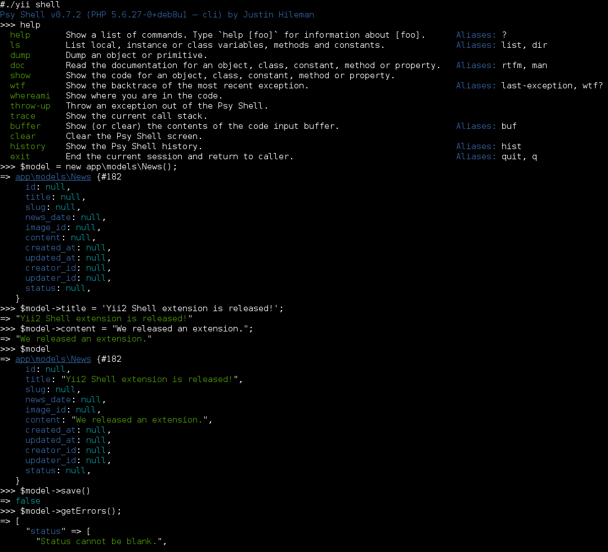

<p align="center">
    <a href="https://github.com/yiisoft" target="_blank">
        
    </a>
    <h1 align="center">Interactive Shell Extension for Yii 2</h1>
    <br>
</p>

This extension provides an interactive shell for [Yii framework 2.0](https://www.yiiframework.com) based on [psysh](https://psysh.org/).

For license information check the [LICENSE](LICENSE.md)-file.

[](https://packagist.org/packages/yiisoft/yii2-shell)
[](https://packagist.org/packages/yiisoft/yii2-shell)


Installation
------------

The preferred way to install this extension is through [composer](https://getcomposer.org/download/).

Either run

    composer require yiisoft/yii2-shell

or add

```json
"yiisoft/yii2-shell": "~2.0.0"
```

to the `require` section of your composer.json.


Usage
-----

After installation, you will be able to run the interactive shell via command line:

```
# Change path to your application's root directory
cd path/to/myapp

# Start the interactive shell
./yii shell
```

You can access the application object using `Yii::$app`. Additionally you have access to all your and your dependencies' classes.

See [psysh's website](https://psysh.org/#features) for a list of available features.


Configuration
-------------

You can configure the PsySH shell by setting options via the `shellConfig` variable in the controller, i.e. add this to your console application configuration:


```
'controllerMap' => [
    'shell' => [
        'shellConfig' => [
            'updateCheck' => 'weekly',
            'verbosity' => \Psy\Configuration::VERBOSITY_VERBOSE,
        ],
    ],
],
```

See https://github.com/bobthecow/psysh/wiki/Config-options for a list of PsySH configurable options.

**Note**: `updateCheck` is explictly set to _never_ by yii2-shell. All other PsySH options use default values.


Screenshot
----------

The following screenshot shows a usage example:


